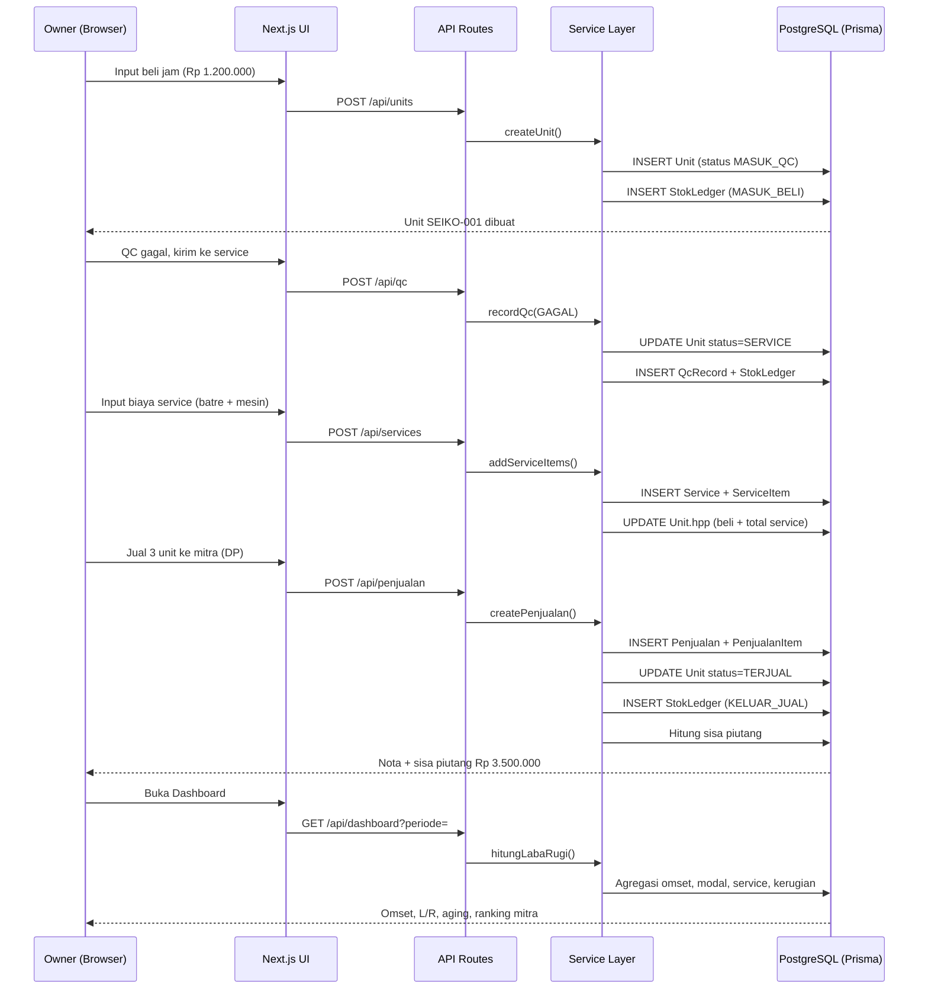
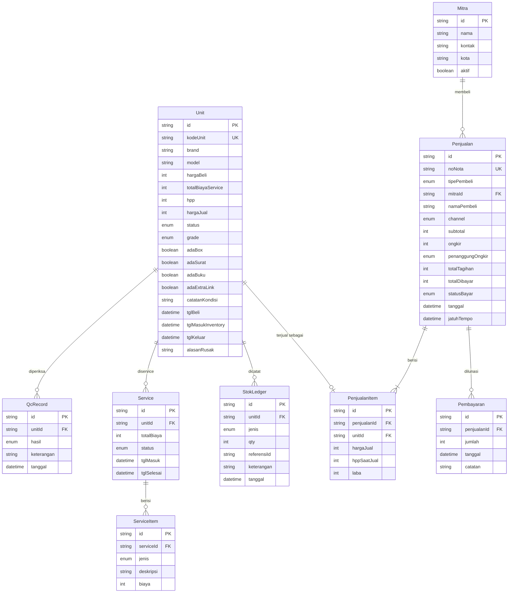

# PRD — Toko Jam Bekas (Sistem Operasional & Keuangan)

> Versi 1.0 · 29 Agustus 2026 · Status: **Menunggu persetujuan**

---

## 1. Overview

Toko jam bekas membeli jam second satuan, memeriksa kondisinya (QC), menserviskan yang bermasalah, lalu menjualnya ke mitra/reseller (B2B) maupun konsumen akhir (B2C). Saat ini seluruh proses ini tidak tercatat rapi, sehingga **modal sebenarnya per jam tidak diketahui** (harga beli sering bertambah biaya service), barang mengendap tanpa disadari, dan laba/rugi hanya bisa dikira-kira.

Aplikasi ini menjadi sistem operasional tunggal yang melacak **setiap jam sebagai unit unik** dari dibeli → QC → service → inventory → terjual (atau ditulis-hapus sebagai kerugian), sekaligus otomatis menghitung modal per unit, omset, laba bersih, piutang mitra, dan umur stok.

**Pengguna:** owner toko (single user).
**Tujuan utama:** tahu persis modal, laba, dan posisi stok setiap saat — tanpa pembukuan manual.

---

## 2. Requirements

| Aspek | Ketentuan |
|-------|-----------|
| **Aksesibilitas** | Web app responsive (dipakai dari laptop toko & HP) |
| **Pengguna** | Single user — owner. Tanpa manajemen user/role di MVP |
| **Auth** | iron-session (login email + password, session cookie httpOnly) |
| **Data Input** | Manual via form. Tanpa import file / API eksternal di MVP |
| **Export** | Excel (.xlsx) untuk Laporan L/R, Stok, dan Ledger. Tanpa PDF di MVP |
| **Pelacakan barang** | **Per-unit serialized** — 1 jam = 1 record unik dengan kode sendiri |
| **Pembelian** | Satuan (1 transaksi beli = 1 unit). Tanpa borongan/alokasi lot |
| **Channel jual** | Offline/toko/COD dan WhatsApp/sosmed (dengan ongkir). Tanpa marketplace |
| **Pembayaran** | Cash (lunas) dan Piutang (tempo/cicilan) |
| **Format uang** | Selalu `Rp 1.000.000` — integer IDR, pemisah ribuan titik, tanpa desimal |
| **Bahasa UI** | Bahasa Indonesia |

---

## 3. Core Features

### 3.1 Manajemen Unit Jam — *Must-have*

Inti dari seluruh sistem. Setiap jam adalah satu record unik.

- **Kode unit otomatis**: `{BRAND}-{urut 3 digit}` → `SEIKO-001`, `SEIKO-002`, `CASIO-001`
- Data per unit: brand, model, kode unit, harga beli, tanggal beli, status, grade kondisi, catatan
- **Checklist kelengkapan**: Box · Surat/Kartu Garansi · Buku Manual · Extra Link · Sertifikat
- **Grade kondisi**: A (mulus) · B (wajar pakai) · C (banyak minus) — diisi saat QC lolos
- **Catatan kondisi** bebas (goresan dial, bezel, dll)
- **HPP unit dihitung otomatis** = harga beli + total biaya service unit tersebut
- Halaman detail unit menampilkan riwayat lengkap: dibeli → QC → service (rinci komponen) → terjual/rusak

### 3.2 Beli Produk — *Must-have*

- Form input jam baru: brand, model, harga beli, tanggal beli, catatan
- Setelah simpan → unit otomatis berstatus **`MASUK_QC`** dan tercatat di ledger sebagai `MASUK — Pembelian`
- Unit berstatus `MASUK_QC` **belum dihitung sebagai stok siap jual**

### 3.3 Quality Control (QC) — *Must-have*

- Halaman antrian berisi semua unit berstatus `MASUK_QC`
- Owner memutuskan per unit:
  - **LOLOS** → isi grade (A/B/C) + kelengkapan + harga jual → status jadi `READY`, masuk inventory, `tglMasukInventory` dicatat (dasar perhitungan umur stok)
  - **GAGAL** → isi keterangan masalah → status jadi `SERVICE`, masuk antrian service
- Setiap keputusan QC tersimpan sebagai riwayat (bisa QC berulang kali setelah service)

### 3.4 Service — *Must-have*

- Halaman antrian berisi semua unit berstatus `SERVICE`
- Satu unit bisa punya beberapa tiket service (mis. sudah pernah ganti batre, lalu ganti mesin)
- Per tiket service, tambahkan **item komponen** (bisa lebih dari satu):
  - Jenis: `BATRE` · `STRAP` · `KACA` · `MESIN` · `LAINNYA` (jenis "LAINNYA" bisa **diketik manual**)
  - Deskripsi + biaya (Rp)
- **Setiap biaya service otomatis menambah HPP unit** — inilah sebab tampilan `SEIKO-001 (BATRE)` dan `SEIKO-001 (MESIN)` di rekap biaya
- Selesai service → unit **kembali ke antrian QC** (`MASUK_QC`) untuk diperiksa ulang
- Loop `QC gagal → service → QC` boleh berulang tanpa batas; semua biaya terakumulasi ke HPP unit

### 3.5 Inventory / Stok — *Must-have*

- Daftar semua unit dengan filter: status, brand, grade, rentang umur stok, rentang harga
- Pencarian cepat by kode unit / brand / model
- Kolom penting: kode, brand-model, grade, HPP, harga jual, margin, **umur stok (hari)**
- **Penanda umur stok**: hijau ≤30 hari · kuning 31–60 · merah >60
- Total **Nilai Stok** = Σ HPP semua unit berstatus `READY`

### 3.6 Barang Rusak (Write-off) — *Must-have*

- Tombol **"Pindahkan ke RUSAK"** tersedia dari unit berstatus `MASUK_QC`, `SERVICE`, maupun `READY`
- Wajib isi alasan + tanggal
- Efek: status jadi `RUSAK`, unit keluar dari stok, dan **seluruh HPP unit langsung diakui sebagai kerugian** pada tanggal tersebut
- Halaman daftar barang rusak + total kerugian per periode
- Aksi ini **bisa dibatalkan** (undo) selama belum tutup periode, untuk jaga-jaga salah klik

### 3.7 Penjualan — *Must-have*

- Satu transaksi penjualan bisa berisi **beberapa unit** (mitra sering borong)
- Header transaksi: tanggal, **tipe pembeli (B2B / B2C)**, mitra (jika B2B), nama pembeli (jika B2C), channel (`OFFLINE` / `WA_SOSMED`), catatan
- Item: pilih unit berstatus `READY` → harga jual final (boleh diubah dari harga list, mis. nego)
- Biaya tambahan: **ongkir** + pilihan penanggung (`PEMBELI` / `TOKO`)
  - Ditanggung pembeli → tidak mengurangi laba
  - Ditanggung toko → mengurangi laba transaksi
- **Pembayaran**: `CASH` (lunas seketika) atau `PIUTANG` (isi jumlah dibayar/DP + jatuh tempo)
- Setelah simpan: unit jadi `TERJUAL`, ledger tercatat `KELUAR — Penjualan`, laba per unit terkunci

### 3.8 Mitra (B2B) — *Must-have*

- Master data mitra: nama, kontak/WA, kota, catatan, status aktif
- Halaman detail mitra: total transaksi, total omset, total laba, unit dibeli, **sisa piutang**, riwayat pembelian
- **Ranking mitra** — diurutkan berdasarkan omset / laba / jumlah unit (bisa dipilih), dengan filter periode

### 3.9 Piutang — *Must-have*

- Daftar semua transaksi berstatus `BELUM_LUNAS` / `SEBAGIAN`
- Per transaksi: total tagihan, sudah dibayar, **sisa piutang**, jatuh tempo, umur piutang
- Form **catat pembayaran** (cicilan boleh berkali-kali) → status otomatis berubah ke `LUNAS` saat sisa = 0
- Penanda **jatuh tempo terlewat** (merah) di dashboard
- Total piutang berjalan ditampilkan di dashboard

### 3.10 Stok Ledger — *Must-have*

Buku besar pergerakan barang — sumber kebenaran untuk audit stok.

| Jenis | Arah | Dipicu oleh |
|-------|------|-------------|
| `MASUK_BELI` | +1 | Beli produk |
| `MASUK_QC_LOLOS` | — | QC lolos (unit resmi masuk inventory) |
| `KELUAR_SERVICE` | — | QC gagal, unit masuk bengkel |
| `MASUK_SERVICE_SELESAI` | — | Service selesai |
| `KELUAR_JUAL` | −1 | Penjualan |
| `KELUAR_RUSAK` | −1 | Write-off barang rusak |

- Semua baris ledger dibuat **otomatis oleh sistem** (tidak bisa diinput manual) agar stok tidak pernah beda dengan realita
- Filter periode, jenis, brand, unit + export Excel

### 3.11 Dashboard — *Must-have*

Semua angka mengikuti filter periode (default: bulan berjalan).

**Baris kartu utama**

- **Omset** — total penjualan periode
- **Laba Bersih (L/R)** — lihat rumus di §7
- **Modal Terpakai** — total harga beli unit yang terjual
- **Biaya Service** — total biaya service yang melekat pada unit terjual
- **Kerugian Barang Rusak** — total HPP unit yang di-write-off periode ini
- **Nilai Stok** — Σ HPP unit `READY` (posisi saat ini, bukan periode)
- **Piutang Berjalan** — total sisa tagihan belum lunas

**Panel**

- **B2B vs B2C** — omset, jumlah unit, dan persentase masing-masing
- **Barang mengendap** — daftar unit `READY` dengan umur stok **>30 hari**, diurutkan dari yang paling lama, lengkap dengan HPP dan harga jualnya
- **Ranking mitra** — top 10 mitra periode ini
- **Ringkasan status unit** — berapa unit di `MASUK_QC`, `SERVICE`, `READY`
- **Rincian biaya service per unit** — format `SEIKO-001 (BATRE) — Rp 50.000`

### 3.12 Laporan & Export — *Must-have*

- Laporan L/R per periode dengan rincian per baris komponen (omset, modal, service, kerugian, ongkir toko)
- Export Excel: Laporan L/R · Daftar Stok · Stok Ledger · Piutang

---

### Nice-to-have (Fase 2 — di luar MVP)

- Upload foto per unit
- Spesifikasi teknis lengkap (referensi, tipe mesin, diameter case, tahun)
- Master supplier / asal barang + ranking supplier
- Pembelian borongan (lot) + alokasi modal per unit
- Channel marketplace (Shopee/TikTok) beserta biaya admin
- Multi-user + role (Staff, Teknisi)
- Stok sparepart terpisah (batre, strap, kaca) dengan qty
- Barcode/QR label per unit untuk scan cepat

---

## 4. User Flow

### Flow Utama: Dari Beli sampai Terjual

1. Owner membeli jam Seiko seharga `Rp 1.200.000` → input di **Beli Produk**
2. Sistem membuat unit `SEIKO-001`, status `MASUK_QC`, HPP = `Rp 1.200.000`
3. Owner buka **QC** → periksa → **GAGAL**, catatan: "mesin mati, batre soak"
4. Status jadi `SERVICE`, masuk antrian bengkel
5. Owner buka **Service** → buat tiket → tambah item: `BATRE Rp 50.000` + `MESIN Rp 350.000`
6. HPP `SEIKO-001` otomatis jadi `Rp 1.600.000`
7. Service selesai → unit kembali ke antrian **QC**
8. QC ulang → **LOLOS** → grade `B`, kelengkapan: box ada, surat tidak ada → harga jual `Rp 2.300.000`
9. Status jadi `READY`, `tglMasukInventory` = hari ini, unit muncul di **Inventory**
10. Mitra "Toko Waktu Jaya" beli 3 unit termasuk `SEIKO-001` → input di **Penjualan**, tipe `B2B`, bayar DP `Rp 3.000.000` dari total `Rp 6.500.000` → sisa piutang `Rp 3.500.000`
11. Unit jadi `TERJUAL`. Laba `SEIKO-001` = `2.300.000 − 1.600.000` = **`Rp 700.000`**
12. Dua minggu kemudian mitra melunasi → catat di **Piutang** → status `LUNAS`
13. Semua angka otomatis muncul di **Dashboard** dan **Laporan L/R**

### Flow Alternatif: Barang Rusak Total

1. Saat QC (atau saat service) ternyata jam tidak bisa diselamatkan
2. Owner klik **Pindahkan ke RUSAK** → isi alasan
3. Unit keluar stok, HPP-nya (`harga beli + service yang terlanjur dikeluarkan`) diakui **kerugian** di tanggal tersebut
4. Muncul di kartu **Kerugian Barang Rusak** di dashboard dan mengurangi Laba Bersih

### Edge Cases & Validasi

- **Unit tidak boleh dijual** kecuali berstatus `READY` — dropdown penjualan hanya menampilkan unit `READY`
- **Unit yang sudah `TERJUAL` atau `RUSAK`** tidak bisa diedit harga belinya (kunci data historis)
- **Harga jual < HPP** → tetap boleh disimpan, tapi muncul peringatan "Transaksi ini rugi Rp xxx" dan baris ditandai merah di laporan
- **Pembayaran piutang melebihi sisa tagihan** → ditolak dengan pesan jelas
- **Hapus unit** hanya boleh jika belum pernah ada pergerakan ledger selain `MASUK_BELI`; selain itu gunakan write-off
- **Empty state** di semua halaman: pesan ramah + tombol aksi (mis. "Belum ada unit di antrian QC")
- **Kode unit bentrok** (beli 2 jam brand sama bersamaan) → nomor urut di-generate dalam transaksi DB agar tidak duplikat
- **Periode dashboard tanpa data** → tampilkan `Rp 0`, bukan error atau kosong
- **Ongkir tanpa penanggung** → wajib dipilih sebelum simpan
- **Undo write-off** mengembalikan unit ke status sebelumnya dan menghapus baris ledger `KELUAR_RUSAK`

---

## 5. Architecture



**Prinsip arsitektur**

- Semua mutasi stok & uang melewati **service layer**, tidak pernah langsung dari komponen UI
- Operasi multi-tabel (jual, write-off, QC) dibungkus **transaksi DB** agar stok & ledger tidak pernah setengah jalan
- `Unit.hpp` disimpan sebagai kolom (denormalisasi) dan **selalu di-recalculate oleh service layer** setiap ada perubahan biaya service — supaya laporan cepat tanpa join berat

---

## 6. Database Schema



| Tabel | Fungsi |
|-------|--------|
| `Unit` | Inti sistem — 1 record = 1 jam fisik, menyimpan modal, HPP, status, dan kondisi |
| `QcRecord` | Riwayat setiap pemeriksaan QC (bisa berkali-kali per unit) |
| `Service` | Tiket service per unit |
| `ServiceItem` | Rincian komponen & biaya dalam satu tiket service |
| `Mitra` | Master data pembeli B2B, dasar ranking mitra |
| `Penjualan` | Header transaksi jual (nota), termasuk ongkir & status pembayaran |
| `PenjualanItem` | Unit yang terjual dalam nota, dengan HPP & laba yang **dikunci** saat transaksi |
| `Pembayaran` | Riwayat cicilan/pelunasan piutang |
| `StokLedger` | Buku besar pergerakan barang, dibuat otomatis, tidak bisa diedit manual |

**Enum**

```
StatusUnit        : MASUK_QC | SERVICE | READY | TERJUAL | RUSAK
GradeUnit         : A | B | C
HasilQc           : LOLOS | GAGAL
StatusService     : PROSES | SELESAI
JenisKomponen     : BATRE | STRAP | KACA | MESIN | LAINNYA
TipePembeli       : B2B | B2C
ChannelJual       : OFFLINE | WA_SOSMED
PenanggungOngkir  : PEMBELI | TOKO
StatusBayar       : LUNAS | SEBAGIAN | BELUM_LUNAS
JenisLedger       : MASUK_BELI | MASUK_QC_LOLOS | KELUAR_SERVICE |
                    MASUK_SERVICE_SELESAI | KELUAR_JUAL | KELUAR_RUSAK
```

---

## 7. Design & Technical Constraints

### Tech Stack

- **Frontend:** Next.js 15 (App Router) + React + Tailwind CSS
- **Backend:** Next.js API Routes + service layer terpisah
- **ORM:** Prisma
- **Database:** PostgreSQL
- **Auth:** iron-session (single user, cookie httpOnly)
- **Export:** SheetJS (xlsx)
- **Deploy:** EasyPanel

### UI System

- Mode: **Dark (deep navy)** — mengikuti design system app Rizky yang lain
- Font Sans: `Geist Mono, ui-monospace, monospace`
- Font Mono: `JetBrains Mono, monospace`
- Responsive: layout tabel berubah jadi kartu di layar HP
- Dropdown dengan banyak isi (pilih unit, pilih mitra) memakai **searchable dropdown**
- Warna status konsisten di seluruh app:
  `MASUK_QC` abu · `SERVICE` kuning · `READY` hijau · `TERJUAL` biru · `RUSAK` merah

### Naming Convention

- Label UI & istilah bisnis: **Bahasa Indonesia**
- Fungsi, variabel, komponen React: **English** / camelCase / PascalCase
- API routes: kebab-case (`/api/stok-ledger`)
- Enum: UPPER_SNAKE_CASE

### Business Logic Hardcoded

> Aturan berikut **tidak boleh diubah tanpa konfirmasi Rizky.**

1. **Format uang**: seluruh nominal ditampilkan `Rp 1.000.000` — integer IDR, pemisah ribuan titik, **tanpa desimal**. Disimpan di DB sebagai `Int` (rupiah penuh), bukan float.

2. **HPP per unit**
   ```
   HPP = hargaBeli + Σ(semua biaya service pada unit tersebut)
   ```

3. **Laba per unit terjual**
   ```
   Laba unit = hargaJual − HPP saat jual
   ```
   `hppSaatJual` dan `laba` **dikunci (snapshot)** di `PenjualanItem` saat transaksi dibuat, sehingga laporan historis tidak berubah walau data unit disentuh belakangan.

4. **Laba/Rugi periode**
   ```
   L/R = Σ omset
       − Σ modal (harga beli unit terjual)
       − Σ biaya service (unit terjual)
       − Σ kerugian barang rusak (write-off periode ini)
       − Σ ongkir yang ditanggung TOKO
   ```
   Dengan `Omset = Σ hargaJual unit terjual` (ongkir yang ditanggung pembeli **bukan** omset).

5. **Pengakuan biaya (matching principle)**
   - Biaya service melekat pada unit dan **baru diakui sebagai beban saat unit terjual**
   - Biaya service pada unit yang masih `READY` adalah **nilai persediaan**, bukan beban
   - Kerugian write-off diakui **penuh pada tanggal unit dipindah ke `RUSAK`**

6. **Nilai Stok**
   ```
   Nilai Stok = Σ HPP semua unit berstatus READY
   ```

7. **Umur stok (aging)** dihitung dari `tglMasukInventory` (tanggal QC **LOLOS**), **bukan** dari tanggal beli — karena barang di bengkel belum bisa dijual.
   Bucket: `0–30` · `31–60` · `61–90` · `>90` hari. Dashboard menyorot **>30 hari**.

8. **Omset diakui** pada tanggal transaksi penjualan (accrual), **bukan** tanggal uang diterima. Piutang dilaporkan terpisah sebagai posisi kas.

9. **Kode unit** `{BRAND}-{urut 3 digit}`, nomor urut per brand, di-generate dalam transaksi DB.

10. **Unit hanya bisa dijual dari status `READY`.** Tidak ada jalur lain.

11. **StokLedger tidak pernah diinput manual** — hanya dibuat oleh service layer sebagai efek samping aksi bisnis.

### Constraint Lain

- **Integritas data:** semua aksi yang menyentuh lebih dari satu tabel wajib dalam `prisma.$transaction`
- **Keamanan:** seluruh route (kecuali `/login`) diproteksi middleware iron-session; rate limit pada endpoint login
- **Performa:** target di bawah 500 unit/tahun — index pada `Unit.status`, `Unit.kodeUnit`, `Penjualan.tanggal`, `StokLedger.tanggal`
- **Backup:** backup harian PostgreSQL via EasyPanel
- **Timezone:** Asia/Jakarta (WIB) untuk semua tampilan tanggal dan batas periode laporan
- **Tanpa soft delete pada data transaksi** — koreksi dilakukan lewat aksi eksplisit (undo write-off, edit nota), bukan hapus diam-diam

---

## 8. Rencana Implementasi

| Tahap | Isi | Estimasi |
|-------|-----|----------|
| **1. Fondasi** | Setup Next.js + Prisma + PostgreSQL, schema, seed, auth iron-session, layout & design system | 1 hari |
| **2. Alur barang** | Beli Produk → QC → Service → Inventory + Stok Ledger otomatis | 2 hari |
| **3. Penjualan** | Master Mitra, transaksi jual B2B/B2C, ongkir, piutang & pembayaran | 2 hari |
| **4. Rusak & koreksi** | Write-off, undo, halaman barang rusak | 0,5 hari |
| **5. Dashboard & laporan** | Semua kartu, aging, B2B vs B2C, ranking mitra, L/R, export Excel | 1,5 hari |
| **6. Polish & deploy** | Empty state, validasi, responsive HP, deploy EasyPanel | 1 hari |

**Total estimasi: ± 8 hari kerja.**

---

## 9. Yang Sengaja TIDAK Dibuat di MVP

Dicatat agar tidak ada salah paham di kemudian hari:

- Foto unit, spesifikasi teknis detail, dan master supplier
- Pembelian borongan/lot beserta alokasi modal
- Integrasi marketplace (Shopee/Tokopedia/TikTok) dan biaya adminnya
- Multi-user, role, dan audit log per user
- Stok sparepart terpisah dengan qty sendiri
- Biaya operasional toko (sewa, gaji, listrik) — L/R di sini adalah **laba kotor barang**, belum laba bersih usaha
- Cetak nota/PDF dan barcode label

---

## 10. Persetujuan

- [ ] Overview & tujuan sudah sesuai
- [ ] Alur Beli → QC → Service → Inventory → Jual sudah sesuai praktik di toko
- [ ] Rumus HPP dan L/R (§7) sudah benar menurut cara hitung Rizky
- [ ] Daftar fitur MVP dan yang ditunda (§9) sudah disepakati
- [ ] Tech stack & deploy EasyPanel disetujui

**Setelah PRD ini disetujui, implementasi kode baru dimulai.**
